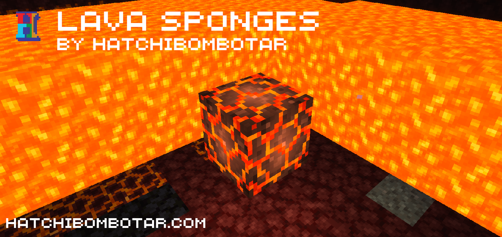
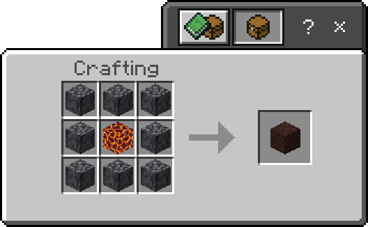
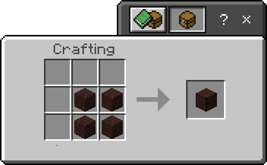

# Lava Sponges Add-On
This add-on adds lava sponges. It can remove lava from spaces such as lava pools or even the nether.

First, craft the lava sponge.

After crafting it with a magma block and basalt surrounding it you can bring it to the nether or any other lava pool. Place it down touching lava and the surrounding area will be removed of lava.

After using the sponge, scrape it with an axe to re-use it.

Need more lava cleared? Compress your lava sponge by putting it in a 2x2 grid in the crafting table. This increases the diameter cleared by 4 blocks.

You can even compress compressed lava sponges to get another 4 blocks of radius.

Check out a video of the add-on in action:
[https://youtu.be/pJxPcQXRp3A]()

[Download](https://github.com/Hatchibombotar/lava-sponges-addon/releases/download/latest-build/lava-sponges.addon)
